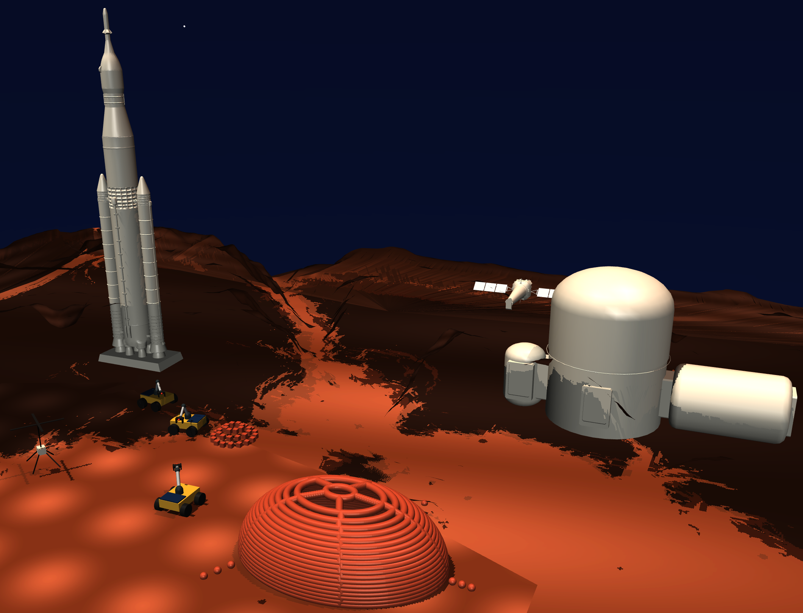

# ATOMZ

We are building a verifiable multi-agent construction RL environment + a swarm policy trained in it + a demo wrapper.

Users pick a Mars construction blueprint in the web UI, which dispatches an AI agent (via Modal) to run a physics-based build simulation. The simulation runs in the `robot_env` MuJoCo environment, and the live output streams back to the browser.


---

## Sponsor Technologies

How each sponsor's tech is used in this project:

- **HUD** — the robot/VLA backbone. Every robot embodiment is a HUD `RobotBridge`, served
  over HUD's `robot` (openpi/0) capability and graded by HUD `Environment` / `Taskset`. The
  swarm manipulation RL env (`core/robot_env/swarm_hud_env.py`), the dataset recorder, and
  the VLA eval runner (`run_swarm_vla.py`) all run on the HUD SDK; `robot_training/` is HUD's
  worldsim-template, our RL training/eval reference.
- **Modal** — all serverless compute. The FastAPI orchestration backend (`core/main.py`)
  runs as a Modal app, and the whole VLA pipeline runs as Modal A100 functions: supervised
  finetuning (`core/train/sft_modal.py`), the reinforcement-finetuning loop
  (`core/train/rl_loop.py`), and the policy inference server
  (`core/robot_env/serve/pi05_modal_mars.py`). See `TRAINING.md`.
- **MiniMax** — two places. (1) **MiniMax M3** is the LLM coordinator that assigns robots to
  build tasks (`core/orchestration/coordinator.py`). (2) **MiniMax image-to-video** generates
  the cinematic Mars build clips in the web UI (`frontend/scripts/generate-mars-video.ts`).
- **Fireworks** — serves MiniMax M3 via its OpenAI-compatible inference API
  (`api.fireworks.ai`); the coordinator falls back to a greedy heuristic if the key is absent.
- **Google DeepMind** — **MuJoCo** is the physics + rendering engine for the entire sim
  (`robot_env/*.xml`, every bridge), and **Gemma / PaliGemma** is the vision-language backbone
  inside the pi0.5 VLA we finetune.
- **Antim Labs** — `robot_training/` is the Antim Labs × HUD *worldsim-template* (Newton
  physics + Gizmo-generated scenes). Our pi0.5 serve/eval path mirrors its reference
  implementation (`serve/policy_server.py`, `run_vla.py`).
- **Anthropic** — this project was developed with **Claude Code** (Claude Opus); the
  `anthropic` SDK is also available through the HUD SDK for LLM-driven agents.

*Not used in this build:* Daytona, SixtyFour, Exa.

---

## Repository Layout

```
constructive_feedback/
├── frontend/       Next.js (TypeScript) — blueprint selector UI + simulation viewer
├── core/           All Python, one uv env (pyproject.toml here)
│   ├── main.py          FastAPI + Modal backend — the orchestration API
│   ├── orchestration/   LangGraph state machine (plan → assign → dispatch → monitor → replan)
│   │   └── mujoco_adapter.py   RoverEnvAdapter: bridges robot_env to the Brain's EnvInterface
│   ├── robot_env/       Mars MuJoCo sim — rover + pick-place arm bridges; record_dataset.py (VLA demos)
│   └── tests/           smoke_test.py — end-to-end integration check
└── robot_training/ Git submodule — worldsim-template RL toolkit (Newton physics, VLA eval, recording)
```

All the Python — the backend (`main.py`), the Brain (`orchestration/`), and the sim
(`robot_env/`) — shares one env under `core/`, because the API runs the Brain and the
adapter imports the sim in-process. The Modal *container* still gets its deps from
`image.pip_install(...)` in `main.py`; `core/pyproject.toml` is the local/dev env.
`frontend/` is a standalone Next.js app; `robot_training` is a submodule with its own env.

### `frontend`

Next.js 15 / TypeScript / Tailwind CSS.

The landing page renders a grid of Mars construction blueprint cards (habitat domes, research labs, greenhouses, etc.). Clicking a card fires a request to the backend and navigates to the simulation viewer, which will stream live video from the physics environment once the pipeline is wired up.

**Key files**
- `src/app/page.tsx` — blueprint card grid
- `src/app/simulation/[id]/page.tsx` — live simulation viewer (placeholder)
- `src/components/BlueprintCard.tsx` — card component
- `src/data/blueprints.ts` — preset definitions

### `core/main.py` (the backend)

Python 3.12 / FastAPI / [Modal](https://modal.com), managed by `uv` (shares `core/`'s env).

Receives blueprint selections from the frontend, spawns the orchestration agent on Modal,
and exposes status/stream endpoints back to the UI. Single-file Modal app (defines
`/simulation/start`, `/simulation/{id}`, `/simulation/{id}/stream`, `/blueprints`).

### `core/orchestration` (the Brain)

LangGraph state machine that plans a build and dispatches it to a sim. Flow:
`init → coordinate → validate → dispatch → monitor → check_done`, looping back through
`replan` on failure. It parses a JSON blueprint into a dependency-ordered task graph,
assigns each task to a robot (greedy or LLM coordinator), and calls the env one Action
at a time. It talks to any sim through one seam — the `EnvInterface` Protocol
(`reset()` / `step(action) -> (obs, reward, done, info)`) in `env_interface.py`.

### `core/robot_env` (the live MuJoCo sim)

A self-contained MuJoCo scene (`mars_scene.xml`) with two HUD `RobotBridge` embodiments:

- **Rover** (`hud_mujoco_bridge.py`, `MarsMujocoBridge`) — a differential-drive rover.
  Action `[forward_speed, turn_speed]`; obs = RGB + 8-vector state
  `[x, y, z, yaw, vx, vy, vz, yaw_rate]`; scores a **drive-to-goal** task (dense progress
  reward + arrival bonus). Drives the orchestration demo via `RoverEnvAdapter`.
- **Arm** (`hud_arm_bridge.py`, `MarsArmPickPlaceBridge`) — a 4-DoF arm + gripper that
  picks 20 cubes from a pile into a dome. Action `[d_yaw, d_shoulder, d_elbow, d_wrist,
  gripper]`; obs = RGB + 16-vector state. Ships a **scripted IK oracle**
  (`_scripted_actions`) that solves the task — the expert used to record VLA demos
  (see *Recording a VLA dataset* below).

### `robot_training`

Git submodule → [`hud-evals/worldsim-template`](https://github.com/hud-evals/worldsim-template)

Newton/MuJoCo robotics RL toolkit on the HUD SDK (four manipulation tasks + VLA policy
eval + dataset recording). We keep it as the **RL training/eval reference** — `run_vla.py`,
`hud eval`, and the recording pipeline — not as the sim we ship.

Requires Python 3.12 and a HUD API key. See `robot_training/README.md` for full docs.

---

## How Everything Connects

```
blueprint (JSON)
   │
   ▼
core/orchestration (the Brain)        core/robot_env (MuJoCo)
  parse → task graph                    mars_scene.xml  ← differential-drive rover
  coordinate (greedy / LLM)                  │
  validate                              MarsMujocoBridge  ← reward + [fwd,turn] control
  dispatch ──Action(command,target)──►  RoverEnvAdapter   (core/orchestration/mujoco_adapter.py)
  monitor ◄──(obs, reward, info)─────►     │  grid cell → world metres
  replan on failure                        │  Action → drive-to-target maneuver
                                           ▼
                                     rover drives to the cell; place/weld/excavate
                                     marks it built; unreachable → rejection_reason → replan
```

- **The Brain plans for a fleet; the sim has one rover.** The adapter treats that rover
  as the shared embodiment — it executes each dispatched Action in order, driving to the
  task's grid cell. Fleet positions live in the Brain's registry, not the sim.
- **One seam, two consumers.** `MarsMujocoBridge` is the single physics core. The Brain
  drives it through `RoverEnvAdapter` (the `EnvInterface`); a VLA policy / `hud eval`
  drives it through HUD's `RobotEndpoint` — same sim, same reward, two front doors.

Run the Brain end-to-end against the rover (from `core/`, no LLM key needed —
`cd core && uv run python - <<'PY'`):

```python
from orchestration.mujoco_adapter import RoverEnvAdapter
from orchestration.graph import run_orchestration
from orchestration.contracts import RobotRegistry, Robot

registry = RobotRegistry(robots=[...])  # the default 6-robot fleet
env = RoverEnvAdapter(render=False)
final = run_orchestration("habitat-dome", env=env, registry=registry, coordinator_mode="greedy")
print(final["done"], final["step"])     # True 14
```

---

## Getting Started

### 0. Clone (with submodule)

```bash
git clone --recurse-submodules https://github.com/srushtismadhure/constructive_feedback.git
cd constructive_feedback

# If you already cloned without --recurse-submodules:
git submodule update --init --recursive
```

### 1. Frontend

```bash
cd frontend
make install   # npm install
make dev       # starts Next.js on http://localhost:3000
```

Copy `.env.local.example` to `.env.local` and set `NEXT_PUBLIC_API_URL` if the backend isn't on `localhost:8000`.

| Command | Description |
|---|---|
| `make dev` | Start dev server with hot reload |
| `make build` | Production build |
| `make lint` | Run ESLint |
| `make clean` | Remove `.next/` and `node_modules/` |

### 2. Core (backend + Brain + MuJoCo sim)

Requires Python 3.12 and [`uv`](https://docs.astral.sh/uv/). One env covers the FastAPI/Modal
backend, the orchestration Brain, and the rover sim. Copy `.env.example` to `.env` and fill in
your Fireworks key and Modal credentials.

```bash
cd core
make install                     # uv sync — creates core/.venv from pyproject.toml
make test                        # end-to-end smoke check (no HUD/LLM key needed)
make dev                         # FastAPI on http://localhost:8000 with --reload

modal token new && make deploy   # authenticate once, then deploy the Modal app
```

| Command | Description |
|---|---|
| `make test` | End-to-end smoke test (bridge + controller + Brain ↔ rover) |
| `make dev` | Local FastAPI server with auto-reload |
| `make deploy` | Deploy to Modal |
| `make lint` / `make format` | Ruff lint / format |
| `make check` | Pyright type check |
| `make clean` | Remove `.venv/`, `__pycache__/`, caches |

### 3. Robot Training Environment

Requires Python 3.12 and a [HUD API key](https://hud.so).

```bash
cd robot_training
uv sync                              # installs all deps incl. bundled Newton wheel
source .venv/bin/activate
hud set HUD_API_KEY=your-key-here

# Readiness check (~1 min first run, compiles Warp)
python scripts/check_setup.py

# Run an example agent
python examples/example_agent.py
```

See `robot_training/README.md` for the full task list, VLA policy eval, and scene authoring guide.

---

## Testing

Everything under `core/` runs from one uv env — `cd core && uv sync` once
(creates `core/.venv` from `core/pyproject.toml`).

### End-to-end (orchestration ↔ rover)

`core/tests/smoke_test.py` is the one command that exercises the whole integration: the
bridge reward, the rover controller, and the Brain driving the rover through a full
build. No HUD or LLM key — it uses the greedy coordinator.

```bash
cd core
uv run python tests/smoke_test.py
```

Expected output (exits non-zero on any failure):

```
[test_bridge_reward]
  bridge reward: reached target, reward=+5.78  OK
[test_controller_reaches_targets]
  controller: 6/6 targets reached  OK
[test_brain_drives_rover]
  brain e2e: build complete in 14 steps  OK

All smoke checks passed.
```

### robot_env (the MuJoCo sim alone)

```bash
cd core
uv run python robot_env/hud_mujoco_bridge.py --steps 8        # bridge smoke (no display)
uv run mjpython robot_env/simulate_rover.py --autopilot       # watch the rover drive (needs a display)
```

### robot_training (the RL toolkit)

```bash
cd robot_training && source .venv/bin/activate
python scripts/check_setup.py        # boots the sim + grades one scripted rollout (~1 min first run)
```

### Backend / frontend

```bash
cd core     && make lint && make check   # ruff + pyright (backend + Brain + sim)
cd frontend && make lint                 # eslint
```

---

## Recording a VLA dataset

Each robot ships a scripted oracle (the **expert**); `core/robot_env/record_dataset.py`
replays it and captures `(image, proprio state, action)` per tick into a **LeRobot v3
dataset** for fine-tuning a VLA (e.g. pi0.5). Two robots via `--robot`:

| `--robot` | Expert | Task |
|---|---|---|
| `arm` (default) | `MarsArmPickPlaceBridge` | pick 20 cubes into a dome |
| `printer` | `MarsPrinterBridge` | print a structure — `--structure dome\|wall\|tower` |

The recorded `observation.state` is **proprioception only** (joints, EE pose, tool state) —
the privileged target coordinates are withheld so the policy must use the camera. Those
coords are still recorded, in a separate **`godmode`** column (deliberately *not* under
the `observation.*` prefix, so no standard training config feeds it to the policy). Use it
for debugging, analysis, reward, or a privileged critic.

```bash
cd core

# 1. Validate the pipeline with NO heavy deps (no torch/lerobot):
uv run python robot_env/record_dataset.py --robot printer --structure tower --dry-run

# 2. Install the recording stack (heavy — pulls lerobot + torch):
uv sync --extra record

# 3. Authenticate to Hugging Face:
huggingface-cli login            # or: export HF_TOKEN=hf_...

# 4. Record + push (add --overwrite when re-running; `create` refuses an existing dir):
uv run python robot_env/record_dataset.py --robot arm \
    --repo-id changminbark/mars-construction-arm --push --overwrite

uv run python robot_env/record_dataset.py --robot printer --structure tower \
    --repo-id <hf-user>/mars-print-tower --push

uv run python robot_env/record_dataset.py --robot swarm \
    --repo-id changminbark/mars-construction-swarm --push
```

Result: a dataset at `https://huggingface.co/datasets/<hf-user>/...`, ready for `lerobot`
to fine-tune pi0.5 on. **HUD/this repo does not train the VLA — `lerobot` does** (offline,
on a GPU); record here, train in lerobot, eval back through HUD.

The local copy is written to `/tmp/lerobot/<repo-id>` (ephemeral staging — the durable
copy is the HF Hub after `--push`). Pass `--root <path>` to keep it elsewhere.

**Caveats:**
- The scene is currently **deterministic** — every episode is identical, so `--episodes 1`
  is the honest dataset. For real VLA diversity, randomize the scene and make the oracle
  read live cube poses first.
- The lerobot dataset API shifts between versions; `record_dataset.py` targets the current
  `LeRobotDataset.create / add_frame / save_episode / finalize` API with a fallback import.
  `finalize()` before push is required — without it the episode-metadata parquet never
  uploads and HF's dataset viewer fails with "Parquet magic bytes not found."

---

## Datasets and Trained Models
Check TRAINING.md for more details:
- https://huggingface.co/datasets/changminbark/mars-construction-swarm
- https://huggingface.co/changminbark/pi05-mars-swarm-sft
- https://huggingface.co/changminbark/pi05-mars-swarm-rl

---

## Updating the Submodule

```bash
# Pull latest upstream changes into robot_training/
git submodule update --remote robot_training
git add robot_training
git commit -m "chore: bump robot_training submodule"
```

## Orchestrator Diagram


